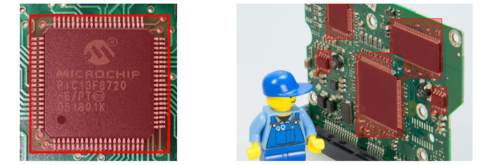
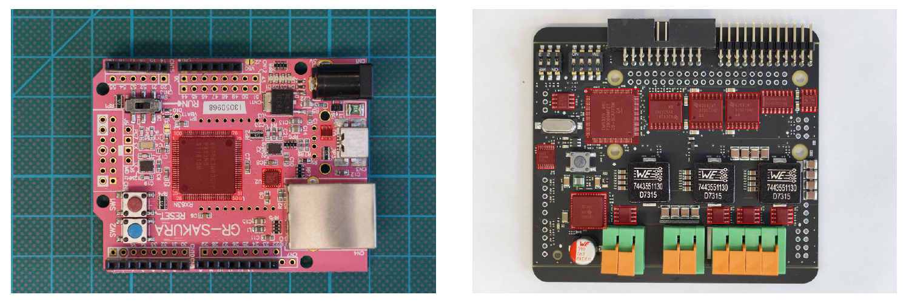
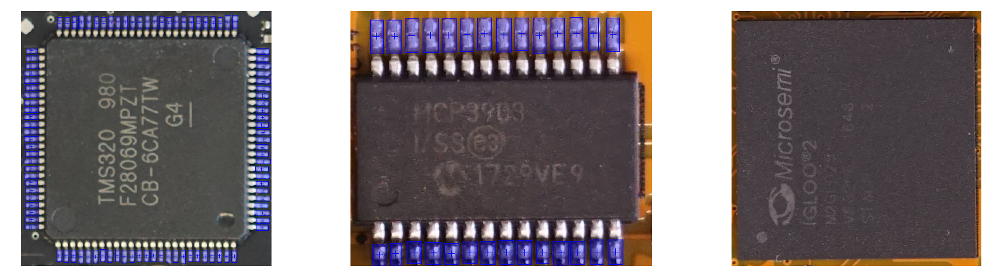

# PCB and pin image data sets

This repository contains image data sets that can be used to train or evaluate
algorithms for automated analysis of populated PCBs. The data sets contain
labels for a single class **IC**. For each labeled object, the outline is
described as polygon.

Besides PCB data sets, there is also a small image data set that is made of
isolated IC images with annotated pins. Pins are annotated as oriented
rectangles.

Annotation data is provided in the form of [COCO
dataset](https://cocodataset.org/) labels stored in JSON format.


## Preview and setup
All of the image data sets contained in this repo can be viewed locally for
example with the [Local COCO Viewer](https://github.com/trsvchn/coco-viewer) or
[FiftyOne](https://github.com/voxel51/fiftyone). The subfolder `viewer`
contains a convenient script to extract and view a single data set using
`FiftyOne`. First, a Python virtual environment with
[Pipenv](https://pypi.org/project/pipenv/) must be set up:
```bash
cd viewer
pipenv install
```

After that, the viewer can be started for an individual data set by running the
`viewer.py` script from within the `viewer` subfolder with the data set name as
single parameter. 
```bash
pipenv run ./viewer.py <data set name>
```

For a list of available data sets, the script can be run with a `-h` / `--help`
parameter:
```bash
pipenv run ./viewer.py --help

usage: Dataset viewer [-h] {ic-pins,pcb-internal,pcb-google}

positional arguments:
  {ic-pins,pcb-internal,pcb-google}

optional arguments:
  -h, --help            show this help message and exit
```

The viewer is then available under the URL `http://localhost:5051`. 


## Data sets
An overview of the datasets in this repository is given below:

### PCB-GOOGLE

- File: [pcb-google.zip](https://github.com/schutzwerk/PROBoter/blob/master/image_data_sets/pcb-google.zip)
- Content: PCB images
- Size: 190 images
- Resolution: mixed
- Image format: mixed
- Labels: Single-class (`ic`)
- Labeled objects: 1100 labeled IC instances
- **Important note:**  
  Due to image copyrights, the original images are NOT included in this
  repository. Instead, they are automatically downloaded by the provided
  `viewer.py` script! The original data set was built in 2019. Therefore, image
  links might be outdated or broken!**

### PCB-INTERNAL

- File: [pcb-internal.zip](https://github.com/schutzwerk/PROBoter/blob/master/image_data_sets/pcb-internal.zip)
- Content: PCB images
- Size: 15 images
- Resolution: 6000 x 4000 pixel
- Image format: `application/png`
- Labels: Single-class (`ic`)
- Labeled objects: 53 labeled IC instances

### IC-PINS

- File: [ic-pins.zip](https://github.com/schutzwerk/PROBoter/blob/master/image_data_sets/ic-pins.zip)
- Content: Isolated chips (mainly TQFP) with small padding extracted from the **PCB-INTERNAL** dataset
- Size: 48 images
- Resolution: mixed
- Image format: mixed
- Labels: Single-class (`pin`)
- Labeled objects: 1181 labeled pins

## License
Both, the **PCB-INTERNAL** and **IC-PINS** data set are licensed under
[GPLv3](https://www.gnu.org/licenses/gpl-3.0.txt). For the **PCB-GOOGLE** data
set we do not provide any image data. It can be retrieved from the contained
links and under the conditions and license of the original authors.
