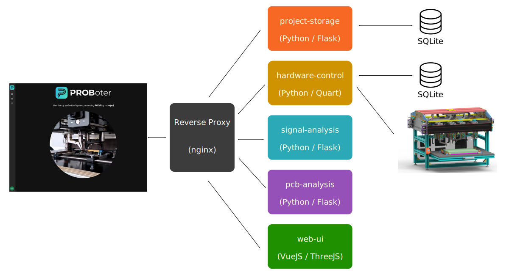
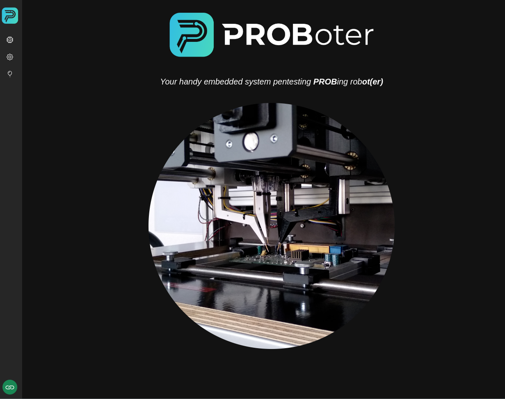

# PROBoter software platform



The PROBoter software platform consists of the following individual components:

- **[project-storage](project-storage/README.md)**:  
  A [Flask](https://flask.palletsprojects.com/en/1.1.x/)-based web server written in Python that manages and persistently stores PCB analysis data. In the current setup, a file-based [SQLite](https://www.sqlite.org/index.html) database is used as storage backend.

- **[hardware-control](hardware-control/README.md)**:
  A microservice written in Python that allows control of the PROBoter hardware platform. The service exposes both, access to low-level functionality, e.g. to calibrate the hardware, as well as high-level probing routines like electrical connectivity measurements. Due to its asynchronous nature and mostly long running tasks, this service uses [Quart](https://github.com/pallets/quart) as main web framework. Most of the service's functionality can be accessed via a REST-like interface. Besides that, it also offers asynchronous event notifications via Websocket endpoints for hardware-related events.

- **[signal-analysis](signal-analysis/README.md)**:  
  A [Flask](https://flask.palletsprojects.com/en/1.1.x/)-based microservice providing voltage signal analysis and bus protocol identification functionality.

- **[pcb-analysis](pcb-analysis/README.md)**:  
  An also [Flask](https://flask.palletsprojects.com/en/1.1.x/)-based microservice providing PCB image analysis functionality.
  
- **[web-ui](web-ui/README.md)**:
  Web-based user interface that utilizes the functionality provided by the PROBoter backend microservices. The [Vue.js](https://vuejs.org/) JavaScript framework is used to build an (hopefully) easily extendable component-based interface.
  


### Installation
Clone the PROBoter software repository to a location of your choice:
```
git clone https://git.ulm.schutzwerk.net/tools/proboter/probotor-software
```

The whole PROBoter software platform with all of its individual components can then be easily started using [Docker Compose](https://docs.docker.com/compose/):
```
docker compose build
docker compose up
```

By default, all traffic is routed through a reverse proxy. Therefore, only port `80` and `443` are exposed by default.

### Development setup
Each of the software components can also be started individually. All of the software components work without real hardware. However, some functionality won't be available in this case.

Detailed information about how to start the individual software components can be found in the `README` files in the separate subfolders.
